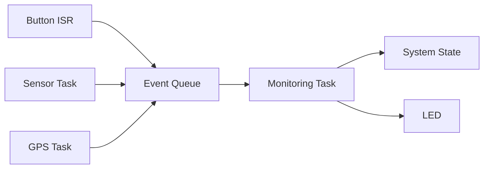

# ESP32 Monitoring Node

Personal embedded project based on **ESP32** and **ESP-IDF**, focused on event-driven monitoring using **FreeRTOS**.

The system handles button interrupts, sensor acquisition, GPS event simulation and system state management through a centralized event queue.

## Features

* FreeRTOS multitasking
* GPIO interrupt handling
* Button debounce
* Inter-task communication using FreeRTOS queues
* AM2301/AM2302 temperature and humidity monitoring
* GPS event simulation
* Centralized event processing
* System state management: `IDLE / ACTIVE`
* LED status indication
* Error handling and logging

## Architecture



## Hardware

| Component              |   GPIO |
| ---------------------- | -----: |
| ESP32                  |      — |
| LED                    | GPIO 2 |
| Push Button            | GPIO 0 |
| AM2301 / AM2302 Sensor | GPIO 4 |

## Software

* **ESP-IDF 6.0.2**
* **C**
* **FreeRTOS**
* **CMake / Ninja**
* **VS Code**

## FreeRTOS Tasks

| Task              | Priority | Function                           |
| ----------------- | -------: | ---------------------------------- |
| `gps_task`        |        6 | GPS event simulation               |
| `monitoring_task` |        5 | Central event processing           |
| `sensor_task`     |        4 | Temperature & humidity acquisition |

### Event Types

```text
BUTTON_PRESSED
GPS_EVENT
SENSOR_EVENT
SENSOR_ERROR
```

All events are sent to a shared FreeRTOS queue and processed by the monitoring task.

## System States

```text
SYSTEM_IDLE
SYSTEM_ACTIVE
```

A button press toggles the system state and updates the LED accordingly.

## Example Output

```text
MONITOR: Monitoring Node started
MONITOR: System ACTIVE
MONITOR: Temperature: 21.0 C, Humidity: 48.0 %
MONITOR: GPS satellites: 8
MONITOR: System IDLE
```

## Project Structure

```text
ESP32-Monitoring-Node/
├── main/
│   ├── main.c
│   └── ...
├── CMakeLists.txt
├── sdkconfig
├── .gitignore
└── README.md
```

## Status

**Functional prototype — built, flashed and tested on ESP32 hardware.**

## Future Improvements

* Replace GPS simulation with a real GPS module
* Add Wi-Fi connectivity
* Publish monitoring data using MQTT
* Improve software modularity by separating drivers, events and application logic
